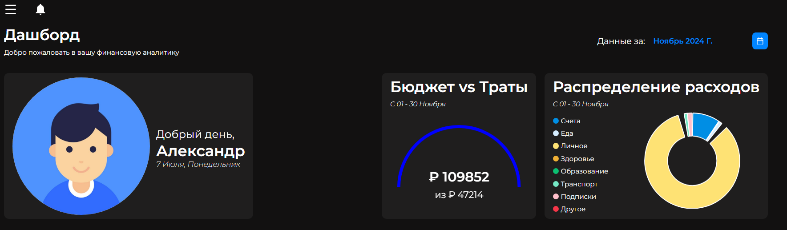
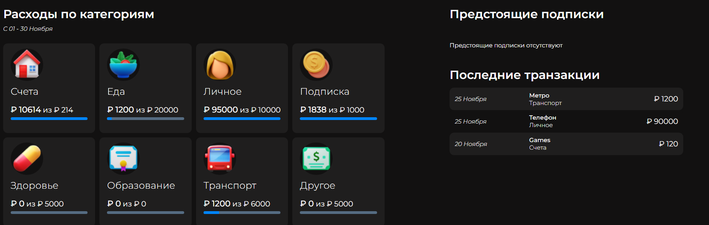
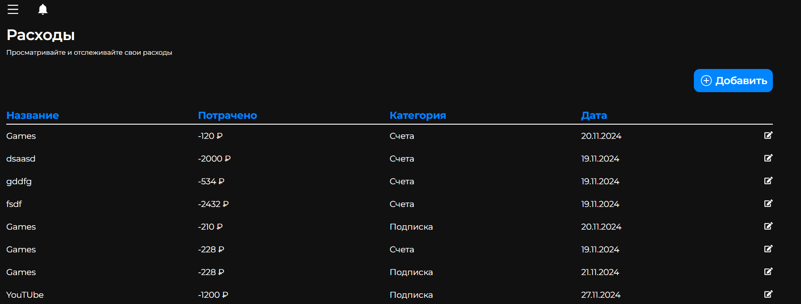
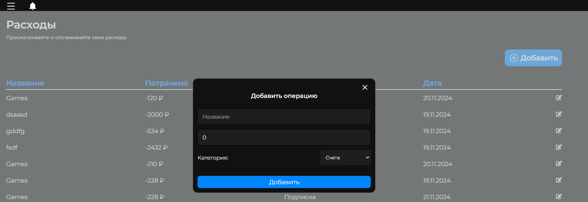
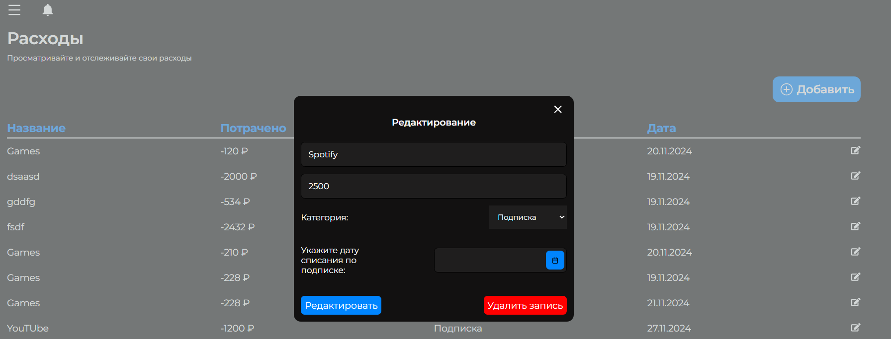
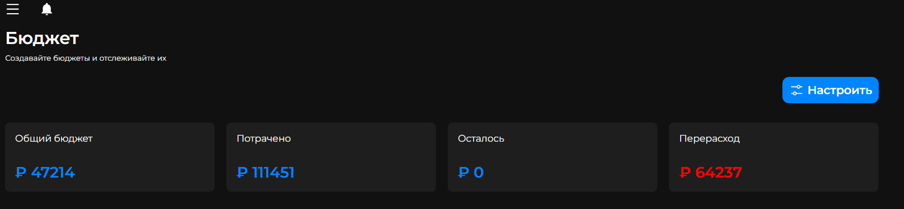
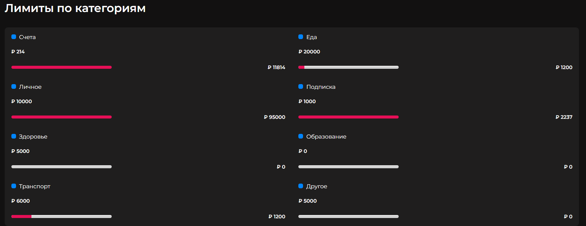
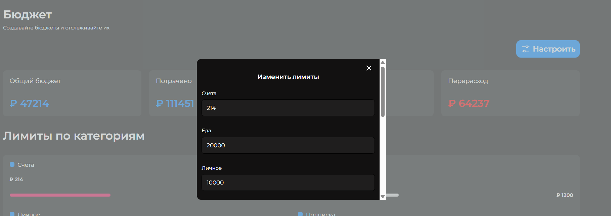
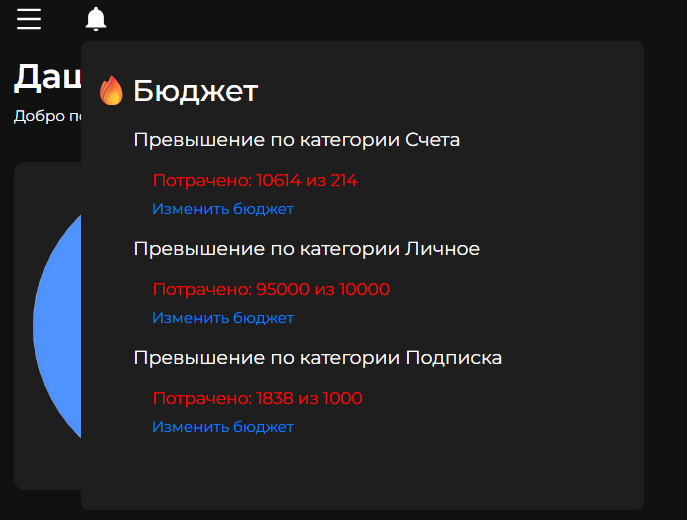
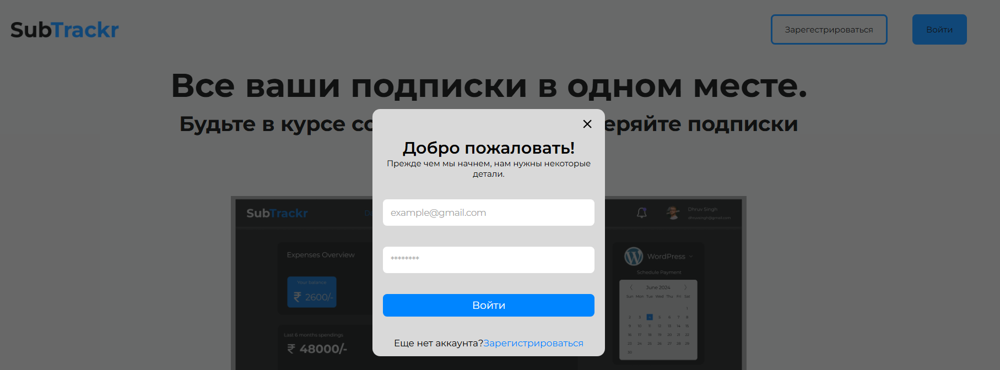

# Финансовый трекер - SubTrackr

## О проекте

Этот репозиторий содержит фронтенд часть приложения для учета личных финансов, разработанного на React. Проект связан с [бэкенд репозиторием](https://github.com/ZIRex03/expense-tracker-backend), где реализована серверная часть и API.

**Важно**:
1. Приложение использует локальную базу данных для разработки, поэтому приложение и его функции недоступны вдля просмотра. Функционал описан ниже в пункте скриншоты
2. Проект находится в разработке, финальная версия приложения может отличаться.

## Основные функции

1. **Дашборд**

    * Визуализация бюджета и расходов (графики)
    * Анализ расходов по категориям (с 1 числа текущего месяца)
    * Предстоящие регулярные платежи
    * История последних транзакций

2. **Управление расходами**

    * Таблица всех расходов
    * Добавление новых расходов
    * Редактирование существующих записей

3. **Управление бюджетом**

    * Обзор бюджета (доходы/расходы/остаток)
    * Настройка лимитов по категориям
    * Контроль перерасходов

4. **Уведомления**

    * Предупреждения о приближении к лимиту
    * Оповещения о регулярных платежах

5. **Профиль пользователя**

    * Форма регистрации/авторизации

## Технологии

* **Frontend:** React, Redux Toolkit, React Router, Chart.js, primereact
* **Стили:** SCSS
* **API:** Axios

## Скриншоты интерфейса

1. **Дашборд**

2. **Управление расходами**

3. **Управление бюджетом**

4. **Уведомления**

5. **Авторизация**

